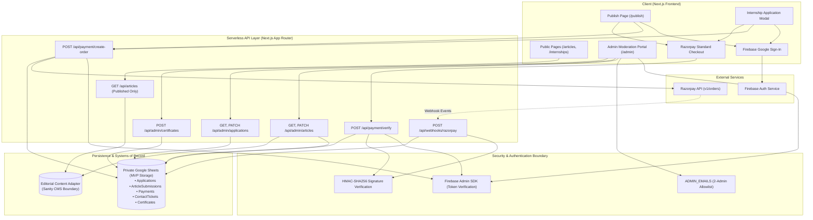

# LexMinds MVP System Architecture

## 1. Architectural Overview

LexMinds is built on Next.js 14 App Router, separating public editorial content, transactional processing, user authentication, and private administrative persistence across distinct boundaries.

---

## 2. Subsystem Boundaries

| Subsystem | Concern | System of Record | Access Control |
| :--- | :--- | :--- | :--- |
| **Public Content** | Articles, internships, static policies | Seed adapter / Sanity CMS | Public read-only |
| **User Identity** | Google Authentication | Firebase Authentication | Google ID Token (Bearer) |
| **Payment Gateway** | Order creation & payment processing | Razorpay Standard | Server-side Key + Secret |
| **Transactions & Submissions** | Applications, submissions, payments, certificates | Private Google Sheets | Server-only Google Service Account JWT |
| **Admin Operations** | Moderation, publishing, certificate issuance | Private Google Sheets | Server-verified `ADMIN_EMAILS` allowlist |

---

## 3. Data Flow Workflows

### 3.1 Paid Internship Enrollment Flow
1. **Student Signs In**: Authenticates with Google via `GoogleAuthGate`.
2. **Form Entry**: Fills personal, institutional, and academic details. (No resume uploaded).
3. **Server Order Creation**: Client sends `productKey: 'internship_enrollment'`. The server validates catalog price (₹299 / 29,900 paise), calls Razorpay API, and creates a pending record in the `Payments` tab.
4. **Razorpay Standard Checkout**: Opens official checkout window.
5. **Server Verification**: Razorpay returns payment ID, order ID, and signature. The server verifies HMAC-SHA256, matches the order and amount, idempotently updates `Payments` tab to `verified`, and creates the application row in `Applications` tab with status `paid`.
6. **Reference Assigned**: Displays confirmed `APP-XXXXX` docket to student.

### 3.2 Paid Article Submission Flow
1. **Author Signs In**: Authenticates with Google.
2. **Manuscript Submission**: Enters author byline, institution, bio, title, abstract, content (or restricted document URL), and signs originality and review declarations.
3. **Server Order Creation**: Server prices order at ₹499 (49,900 paise) and creates pending payment record.
4. **Payment Verification**: On verified payment, server creates `ArticleSubmission` in `ArticleSubmissions` tab with status `paid_submitted`.
5. **Editorial Review Queue**: Article enters moderation queue. It is **not** public until approved by an administrator.

### 3.3 Asynchronous Webhook Recovery
- If a user closes the browser window after payment before the client callback executes, Razorpay sends a signed `payment.captured` webhook.
- Server validates `x-razorpay-signature` against raw request body using `RAZORPAY_WEBHOOK_SECRET`.
- Reconciles payment in `Payments` tab and marks linked application or submission as paid.
